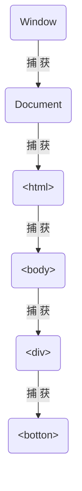
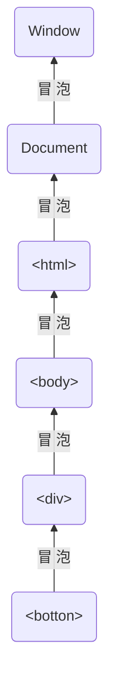

事件的捕捉与传递

× 捕获 -- event.eventPhase : 1

事件首先会被捕获，从Window开始直到event.target，event.currentTarget依次变化

× 处于最顶端元素 -- event.eventPhase : 2

事件传播到event.target, 此时 event.target 即 event.currentTarget指向同一HTML元素

× 捕获 -- event.eventPhase : 3

事件最后会冒泡，从event.target开始直到Window，event.currentTarget依次变化

